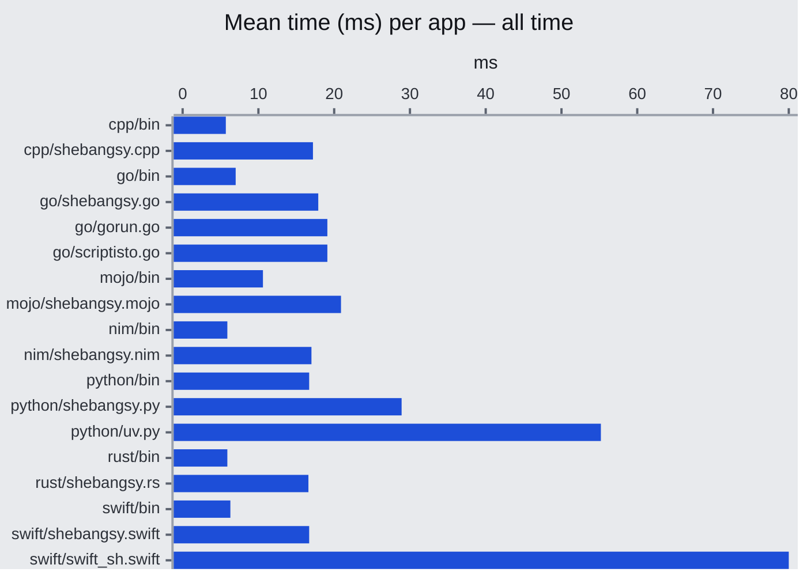

```
   /$$ /$$   /$$                    
  / $$/ $$  | $$                    
 /$$$$$$$$$$| $$  /$$$$$$$ /$$   /$$
|   $$  $$_/| $$ /$$_____/| $$  | $$
 /$$$$$$$$$$|__/|  $$$$$$ | $$  | $$
|_  $$  $$_/     \____  $$| $$  | $$
  | $$| $$   /$$ /$$$$$$$/|  $$$$$$$
  |__/|__/  |__/|_______/  \____  $$
                           /$$  | $$
                          |  $$$$$$/
                           \______/ 
```
<!-- Big money NE - https://patorjk.com/software/taag/#p=testall&f=Bulbhead&t=shebangsy&x=none&v=4&h=4&w=80&we=false> -->

# Shebangsy

**Shebangsy** (also written `#!sy`) runs single-file scripts in **C++, Go, Mojo, Nim, Python 3, Rust, and Swift**. You add a shebang, mark the file executable, and run it like any other program. Dependencies and build flags live in small `#!` directives at the top of the file, so you can pin versions without maintaining a separate project tree for every script.

On a warm cache hit, overhead versus a pre-built binary is on the order of **~10 ms**—enough for interactive use, including shell completions.

**Platforms:** macOS and Linux (POSIX). Windows is not supported.

## Quick start

1. Put **`shebangsy` on your `PATH`** (see [Install](#install)).
2. Start the file with `#!/usr/bin/env -S shebangsy <language>`.
3. Run `chmod +x` on the script and execute it.

Example: save as `gonum-hello.go`, then run it.

```go
#!/usr/bin/env -S shebangsy go
#!requires: gonum.org/v1/gonum

package main

import (
	"fmt"
	"gonum.org/v1/gonum/mat"
)

func main() {
	u := mat.NewVecDense(3, []float64{1, 2, 3})
	v := mat.NewVecDense(3, []float64{4, 5, 6})
	fmt.Println("u · v =", mat.Dot(u, v))
}
```

```sh
chmod +x gonum-hello.go
./gonum-hello.go   # first run: compile, then execute
./gonum-hello.go   # warm cache: run cached binary
```

More samples live under [`examples/`](./examples).

## How it works

The first time you run a script, shebangsy compiles (or materializes) it into a cache under `~/.cache/shebangsy`. Later runs compare the source file’s **size and modification time** to that cache entry. If nothing changed, the cached artifact runs immediately; if the file changed, shebangsy rebuilds. Directive lines (`#!requires:`, `#!flags:`) are stripped before the compiler sees the source.


## Command line

Without a shebang, you can invoke the same pipeline explicitly:

```text
shebangsy <language> <script> [...script args]
```

## Install

**Releases:** prebuilt binaries are on the [releases](https://github.com/bdombro/shebangsy/releases) page. You can copy them to your path (e.g. `~/.local/bin`).

```sh
curl -sSL https://api.github.com/repos/bdombro/shebangsy/releases/latest | grep -Eo 'https://[^"]*aarch64-apple-darwin[^"]*\.zip' | head -1 | xargs curl -sSL -o shebangsy.zip
unzip -o shebangsy.zip && chmod +x shebangsy
mv shebangsy ~/.local/bin/
rm shebangsy.zip
```

From a clone of this repository:

```sh
just install
# or: ./scripts/install.sh
```

That builds with Nimble and installs **`shebangsy`** to **`~/.nimble/bin`**. Ensure that directory is on your **`PATH`** before running.

Pre-built archives (macOS host and Linux glibc) are produced under **`dist/`** when you run:

```sh
just build-cross
# or: ./scripts/build-cross.sh
```

The install script also clears existing cache files under `~/.cache/shebangsy` after a successful install.

## Cache

Artifacts and shared workspaces live under **`~/.cache/shebangsy`**. You normally do not need to touch this directory; changing the script’s size or mtime invalidates its entry.

**When to clear manually:** For example, after changing Swift dependency versions in a shared SwiftPM workspace, or if you want a completely clean slate, remove the cache directory:

```sh
rm -rf ~/.cache/shebangsy
```

There is no separate `cache-clear` subcommand; deleting that path is the supported reset.

## Benchmark

### Results

Mean end-to-end time for small “hello” style programs, averaged over benchmark runs. The chart compares shebangsy to running a compiled `bin` in the same language and to other runners where applicable.

In short, shebangsy is in the same ballpark as alternatives, with roughly **~10 ms** overhead versus a direct binary on warm paths.



### Running the benchmark

```sh
just bench
# or: ./scripts/bench.py
```

See [`benches-report.md`](./benches-report.md) for additional charts.

---

## Language reference

Directives are read from the **first 40 lines** of the script (after the shebang line).

- **`#!requires:`** — dependency specs (meaning varies by language).
- **`#!flags:`** — extra arguments passed to the language’s build tool where supported.

Lines matching these prefixes are **removed** before compile. On a single `#!requires:` line, package tokens are **comma-separated** (Rust allows commas inside `@features=[…]`). You may repeat `#!requires:` and `#!flags:` lines; they are merged in order.

### C++

```cpp
#!/usr/bin/env -S shebangsy cpp
```

**Dependencies (`#!requires:`):** Only **CLI11** is supported.

```cpp
#!requires: cli11
#!requires: cli11@2.4.1
```

If you omit `@version`, CLI11 defaults to **2.4.1**. Any other package name is rejected.

**Flags (`#!flags:`):** Passed through to **CMake** configure (after `-DCMAKE_BUILD_TYPE=Release`).

```cpp
#!flags: -GNinja
#!flags: -DCMAKE_EXPORT_COMPILE_COMMANDS=ON
```

C++ builds use a **shared CMake workspace** under `~/.cache/shebangsy/cpp-workspace/`.

### Go

```go
#!/usr/bin/env -S shebangsy go
```

**Dependencies (`#!requires:`):** One module path per token (no spaces), with a version suffix as with `go get`:

```go
#!requires: github.com/charmbracelet/lipgloss@latest
#!requires: github.com/spf13/cobra@v1.8.0
```

**Flags (`#!flags:`):** Appended to **`go build`** (for example `-tags=…`, `-ldflags=…`).

```go
#!flags: -tags=integration
#!flags: -ldflags=-s
#!flags: -tags=netgo -ldflags=-w
```

Each compile uses a fresh module layout so dependency resolution stays predictable.

### Mojo

```text
#!/usr/bin/env -S shebangsy mojo
```

**Dependencies (`#!requires:`):** PyPI-style names, pinned with `@version` when you need an exact release. Mojo itself is always included.

```text
#!requires: numpy
#!requires: numpy@2.1.0
#!requires: numpy,scipy
```

**Flags (`#!flags:`):** Not supported.

### Nim

```nim
#!/usr/bin/env -S shebangsy nim
```

**Dependencies (`#!requires:`):** Comma-separated Nimble packages; optional `name@version`.

```nim
#!requires: neo
#!requires: neo,argsbarg@2.0.0
```

**Flags (`#!flags:`):** Whitespace-separated tokens appended to **`nim c`** (for example `--mm:refc`, `-d:release`).

```nim
#!flags: --mm:refc -d:danger
#!flags: -d:release
#!flags: --threads:on
```

If a `pixi.toml` exists **above** your script path, compilation runs via **`pixi run nim c`** instead of `nim` directly.

If your filename is not a valid Nim module name, or it would **shadow** a package you import from `#!requires:`, see [`examples/nim/greet_demo.nim`](examples/nim/greet_demo.nim) for a working pattern.

### Python 3

```python
#!/usr/bin/env -S shebangsy python3
```

Use the **`python3`** token on the shebang; **`python`** is an alias (same runner).

**Dependencies (`#!requires:`):** Each token is installed with **`pip`** inside an isolated **`.venv`** for that cache key (any form `pip` accepts).

```python
#!requires: requests
#!requires: httpx==0.27.0
#!requires: pydantic>=2
#!requires: requests[security],httpx==0.27.0
```

**Flags (`#!flags:`):** Not supported (ignored).

### Rust

```rust
#!/usr/bin/env -S shebangsy rust
```

**Dependencies (`#!requires:`):** Comma splitting is bracket-aware so feature lists can contain commas.

```rust
#!requires: serde
#!requires: serde@1
#!requires: serde@1,clap@4
#!requires: clap@4@features=[derive]
#!requires: clap@4@features=[derive,env]
```

Forms: `crate`, `crate@version`, or `crate@version@features=[…]` (version may be `*`).

**Flags (`#!flags:`):** Appended to **`cargo build --release`**.

```rust
#!flags: --locked
#!flags: -Ztimings=html
```

### Swift

```swift
#!/usr/bin/env -S shebangsy swift
```

**Without `#!requires:`:** Single-file **`swiftc -O`** builds.

**With `#!requires:`:** Dependencies are resolved through a **shared SwiftPM workspace** under `~/.cache/shebangsy/swift-workspace/`. Entries **accumulate** in the workspace manifest until you clear the cache (see [Cache](#cache)). Each token must include **`@version`**. For `owner/repo` URLs shebangsy cannot infer, add **`:ProductName`** after the version. First-time builds with dependencies may hit the network.

If the workspace has no `platforms:` block yet, shebangsy may insert **high minimum OS versions** so current Swift APIs compile; adjust in source if you need different deployment targets.

#### Dependencies (`#!requires:`)

```swift
#!requires: swift-argument-parser@1.3.0
#!requires: apple/swift-argument-parser@1.3.0
#!requires: https://github.com/mxcl/PromiseKit.git@6.5.0
#!requires: owner/Repo@2.0.0:ProductName
```

#### Flags (`#!flags:`)

```swift
#!flags: -warnings-as-errors
```

- **No** `#!requires:`: flags go to **`swiftc`** (shebangsy may add `-parse-as-library` when it detects `@main`, unless you already set it).
- **With** `#!requires:`: flags go to **`swift build -c release`**.

---

## Editor tips (VS Code / Cursor)

For syntax highlighting on extensionless scripts, install
[Shebang Language Associator](https://marketplace.visualstudio.com/items?itemName=davidhewitt.shebang-language-associator)
and add:

```json
  "shebang.associations": [
    {
      "pattern": "^#!/usr/bin/env -S shebangsy cpp$",
      "language": "cpp"
    },
    {
      "pattern": "^#!/usr/bin/env -S shebangsy go$",
      "language": "go"
    },
    {
      "pattern": "^#!/usr/bin/env -S shebangsy mojo$",
      "language": "python"
    },
    {
      "pattern": "^#!/usr/bin/env -S shebangsy nim$",
      "language": "nim"
    },
    {
      "pattern": "^#!/usr/bin/env -S shebangsy python3$",
      "language": "python"
    },
    {
      "pattern": "^#!/usr/bin/env -S shebangsy rust$",
      "language": "rust"
    },
    {
      "pattern": "^#!/usr/bin/env -S shebangsy swift$",
      "language": "swift"
    }
  ]
```

## Build

```sh
just build
# or: ./scripts/build.sh
```

Cross-compiled zips (macOS host + Linux glibc) land in `dist/`:

```sh
just build-cross
# or: ./scripts/build-cross.sh
```

## Test

```sh
just test
# or: ./scripts/test.sh
```

Smoke tests cover each language backend; Mojo, C++, Rust, Swift, and Python 3 are skipped automatically when the corresponding toolchain is missing.

## Contributing

Issues and pull requests are welcome. To work locally:

1. **Build:** `just build` (or `./scripts/build.sh`).
2. **Test:** `just test` (or `./scripts/test.sh`).

Follow existing style in the Nim sources under `src/`. The project is POSIX-only.

## License

MIT
