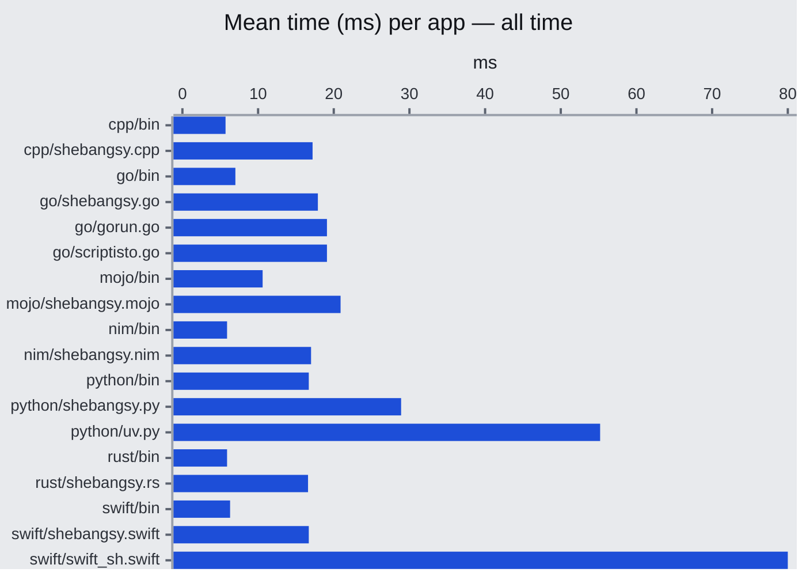

```
   /$$ /$$   /$$                    
  / $$/ $$  | $$                    
 /$$$$$$$$$$| $$  /$$$$$$$ /$$   /$$
|   $$  $$_/| $$ /$$_____/| $$  | $$
 /$$$$$$$$$$|__/|  $$$$$$ | $$  | $$
|_  $$  $$_/     \____  $$| $$  | $$
  | $$| $$   /$$ /$$$$$$$/|  $$$$$$$
  |__/|__/  |__/|_______/  \____  $$
                           /$$  | $$
                          |  $$$$$$/
                           \______/ 
```
<!-- Big money NE - https://patorjk.com/software/taag/#p=testall&f=Bulbhead&t=shebangsy&x=none&v=4&h=4&w=80&we=false> -->

# Shebangsy

**Shebangsy** (also written `#!sy`) runs single-file scripts in **C++, Go, Mojo, Nim, Python 3, Rust, and Swift**. You add a shebang, mark the file executable, and run it like any other program. Dependencies and build flags live in small `#!` directives at the top of the file, so you can pin versions without maintaining a separate project tree for every script.

On a warm cache hit, overhead versus a pre-built binary is on the order of **~10 ms**—enough for interactive use, including shell completions.

**Platforms:** macOS and Linux (POSIX). Windows is not supported.

## Quick start

1. Put **`shebangsy` on your `PATH`** (see [Install](#install)).
2. Start the file with `#!/usr/bin/env -S shebangsy <language>`.
3. Run `chmod +x` on the script and execute it.

Example: save as `gonum-hello.go`, then run it.

```go
#!/usr/bin/env -S shebangsy go
#!requires: gonum.org/v1/gonum

package main

import (
	"fmt"
	"gonum.org/v1/gonum/mat"
)

func main() {
	u := mat.NewVecDense(3, []float64{1, 2, 3})
	v := mat.NewVecDense(3, []float64{4, 5, 6})
	fmt.Println("u · v =", mat.Dot(u, v))
}
```

```sh
chmod +x gonum-hello.go
./gonum-hello.go   # first run: compile, then execute
./gonum-hello.go   # warm cache: run cached binary
```

More samples live under [`examples/`](./examples).

## How it works

The first time you run a script, shebangsy compiles (or materializes) it into a cache under `~/.cache/shebangsy`. Later runs compare the source file’s **size and modification time** to that cache entry. When both still match the cached entry, the cached artifact runs immediately; any change to size or mtime (including `touch` without editing) invalidates the entry and shebangsy rebuilds. Directive lines (`#!requires:`, `#!flags:`) are stripped before the compiler sees the source.

## Command line

Without a shebang, you can invoke the same pipeline explicitly:

```text
shebangsy <language> <script> [...script args]
```

## Install

**Releases:** prebuilt binaries are on the [releases](https://github.com/bdombro/shebangsy/releases) page. You can copy them to your path (e.g. `~/.local/bin`).

```sh
curl -sSL https://api.github.com/repos/bdombro/shebangsy/releases/latest | grep -Eo 'https://[^"]*aarch64-apple-darwin[^"]*\.zip' | head -1 | xargs curl -sSL -o shebangsy.zip
unzip -o shebangsy.zip && chmod +x shebangsy
mv shebangsy ~/.local/bin/
rm shebangsy.zip
```

From a clone of this repository:

```sh
just install
# or: ./scripts/install.sh
```

That builds with Nimble and installs **`shebangsy`** to **`~/.nimble/bin`**. Ensure that directory is on your **`PATH`** before running.

Pre-built archives (macOS host and Linux glibc) are produced under **`dist/`** when you run:

```sh
just build-cross
# or: ./scripts/build-cross.sh
```

The install script also clears existing cache files under `~/.cache/shebangsy` after a successful install.

## Cache

Artifacts and shared workspaces live under **`~/.cache/shebangsy`**. You normally do not need to touch this directory; changing the script’s size or mtime invalidates its entry.

**When to clear manually:** For example, after changing Swift dependency versions in a shared SwiftPM workspace, or if you want a completely clean slate, remove the cache directory:

```sh
rm -rf ~/.cache/shebangsy
```

There is no separate `cache-clear` subcommand; deleting that path is the supported reset.

## Benchmark

### Results

Mean end-to-end time for small “hello” style programs, averaged over benchmark runs. The chart compares shebangsy to running a compiled `bin` in the same language and to other runners where applicable.

In short, shebangsy is in the same ballpark as alternatives, with roughly **~10 ms** overhead versus a direct binary on warm paths.



See [`docs/contributing.md`](./docs/contributing.md#running-the-benchmark) for how to run the benchmark and [`benches-report.md`](./benches-report.md) for more charts.

## Documentation

- **[Language reference](docs/language-reference.md)** — `#!requires:`, `#!flags:`, and per-language behavior.
- **[Contributing](docs/contributing.md)** — build, test, editor tips, architecture, cache model, benchmarks.
- **[Adding a language](docs/adding-a-language.md)** — registration checklist and backend contract.

## License

MIT
