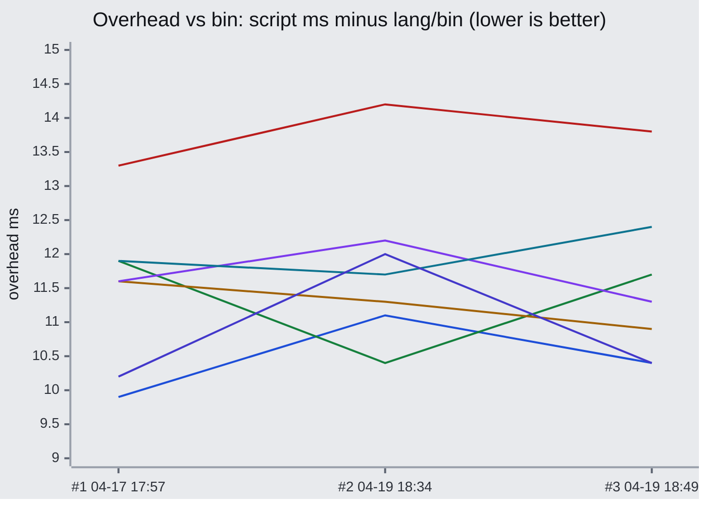
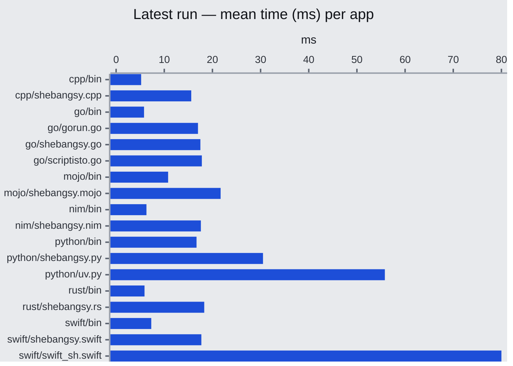
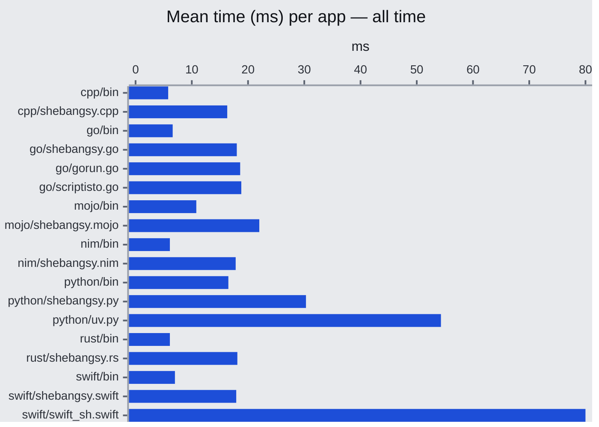
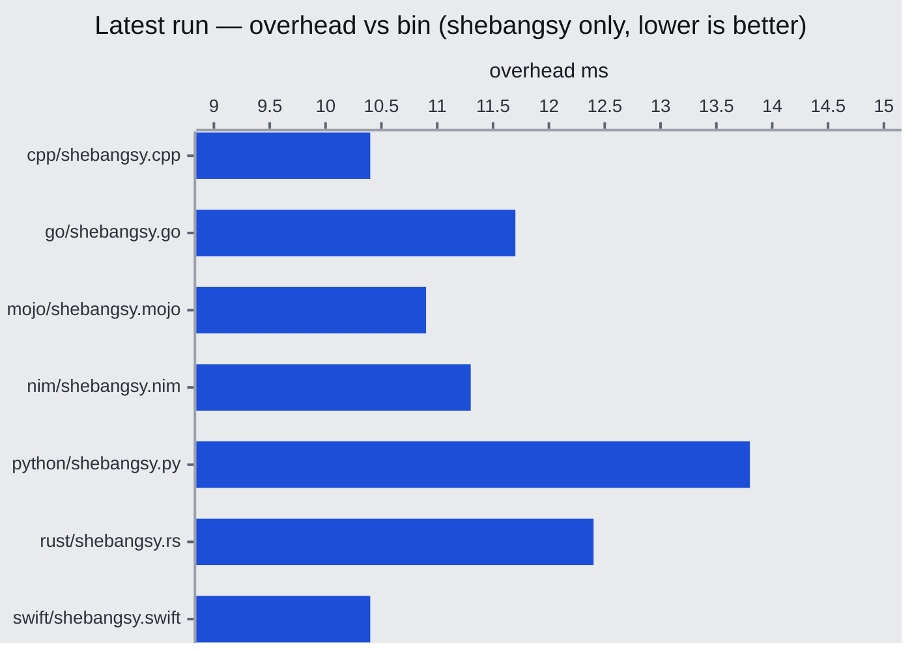
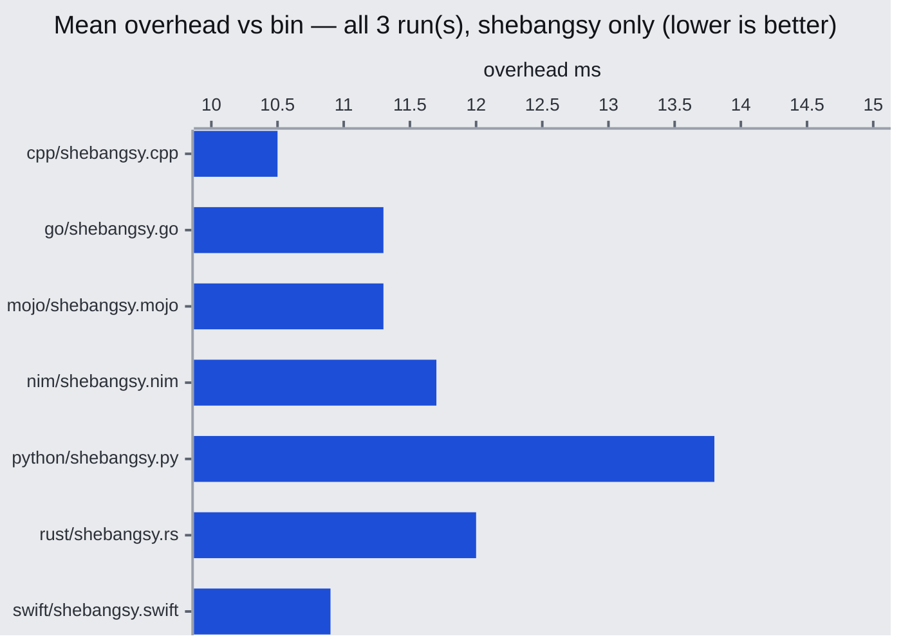

# Benchmark report

Generated from [`benches.jsonl`](./benches.jsonl) (3 run(s)).

**Latest run:** `time=1776620953` · **CPU:** Apple M4 Pro

## Overhead vs `bin` over time

Each line is **mean ms − same-language `bin` ms** for assets whose filename includes `shebangsy` (other runners are omitted). Use it to spot **regressions**: a line drifting **up** means shebangsy is slower vs the compiled baseline; **down** is better vs `bin`.

## Absolute time (ms) - most recent run

Bars are ordered **by language** (A–Z), then **by time ascending** within each language (lower ms first). Axis labels are `lang/asset`; large values are clipped for scale.

## Absolute time (ms) — mean of all runs

**Mean ms per app** across every row in `benches.jsonl`. A run contributes a sample only if that app appears in that row’s results. Same ordering and cap as the latest-run chart.

## Overhead vs `bin` (shebangsy only)

Bars are ordered **by language** (A–Z), then **by overhead ascending** (lower first).

**Mean ms − same-language `bin` ms** for the latest row; same filename filter as the overhead line chart.

## Overhead vs `bin` — mean of all runs (shebangsy only)

**Mean of (script ms − bin ms)** across every row in `benches.jsonl`. Averaging includes only runs where that overhead is defined; same filename filter and bar ordering as the latest overhead chart above.

## Language colors (legend)

Series colors in the charts above follow **language** (first path segment). Use this table to map each language to its **named color** and **hex**.

| Language | Color | Hex |
| --- | --- | --- |
| `cpp` | Blue | `#1d4ed8` |
| `go` | Green | `#15803d` |
| `mojo` | Amber | `#a16207` |
| `nim` | Purple | `#7c3aed` |
| `python` | Red | `#b91c1c` |
| `rust` | Cyan | `#0e7490` |
| `swift` | Indigo | `#4338ca` |
| `other` | Slate | `#64748b` |
