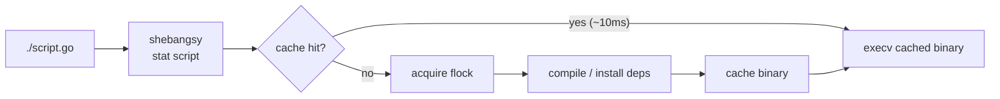

# Contributing

Issues and pull requests are welcome. Follow existing style in the Nim sources under `src/`. The project is POSIX-only.

For a quick local loop, use **Build** and **Test** below.

## Build

```sh
just build
# or: ./scripts/build.sh
```

Cross-compiled zips (macOS host + Linux glibc) land in `dist/`:

```sh
just build-cross
# or: ./scripts/build-cross.sh
```

## Test

```sh
just test
# or: ./scripts/test.sh
```

Smoke tests cover each language backend; examples whose runner’s toolchain is missing are skipped, and the script prints a **WARNING** with a skip count on stderr before the success line. Python examples cold-compile faster when **`uv`** is installed (shebangsy uses it automatically when it is on `PATH`).

## Architecture

On every run, shebangsy calls **`stat`** on the script and checks the cache. A **warm hit** reuses the cached artifact with low overhead (~10 ms). A **cold miss** acquires a file lock, compiles or installs dependencies, writes the cache entry, then runs the result.

**Compiled** backends replace the current process with **`execv`** of the cached binary on the warm path, so there is no parent left to release a compile lock. **Interpreted** backends **`spawn`** a child interpreter and must **release the compile lock** explicitly after starting it; see `src/shebangsy.nim` for the full flow.



## Cache model

- **Layout:** Artifacts and per-script build state live under **`~/.cache/shebangsy`**. Paths mirror script location where needed; compiled backends use **shadow directories** derived from the cache key so each script’s build tree stays isolated.
- **Key:** The cache entry is keyed by the source file’s **size and modification time** (not a content hash). Changing size or mtime invalidates the entry and triggers a rebuild.
- **Stale cleanup:** Within a script’s cache directory, stale sibling binaries for the same path are removed after a successful compile (`cacheSameScriptStaleRemove`). Other old entries can linger until the next invalidation or a full manual reset—see [Cache in the README](../README.md#cache). There is no separate `cache-clear` subcommand.

For directive semantics and per-language behavior, see [Language reference](language-reference.md).

## Adding a language

See [Adding a language](adding-a-language.md) for the registration checklist and backend contract.

## Running the benchmark

```sh
just bench
# or: ./scripts/bench.py
```

See [`benches-report.md`](../benches-report.md) for additional charts.

## IDE setup (VS Code / Cursor)

For syntax highlighting on extensionless scripts, install
[Shebang Language Associator](https://marketplace.visualstudio.com/items?itemName=davidhewitt.shebang-language-associator)
and add:

```json
  "shebang.associations": [
    {
      "pattern": "^#!/usr/bin/env -S shebangsy cpp$",
      "language": "cpp"
    },
    {
      "pattern": "^#!/usr/bin/env -S shebangsy go$",
      "language": "go"
    },
    {
      "pattern": "^#!/usr/bin/env -S shebangsy mojo$",
      "language": "python"
    },
    {
      "pattern": "^#!/usr/bin/env -S shebangsy nim$",
      "language": "nim"
    },
    {
      "pattern": "^#!/usr/bin/env -S shebangsy python3$",
      "language": "python"
    },
    {
      "pattern": "^#!/usr/bin/env -S shebangsy rust$",
      "language": "rust"
    },
    {
      "pattern": "^#!/usr/bin/env -S shebangsy swift$",
      "language": "swift"
    }
  ]
```
