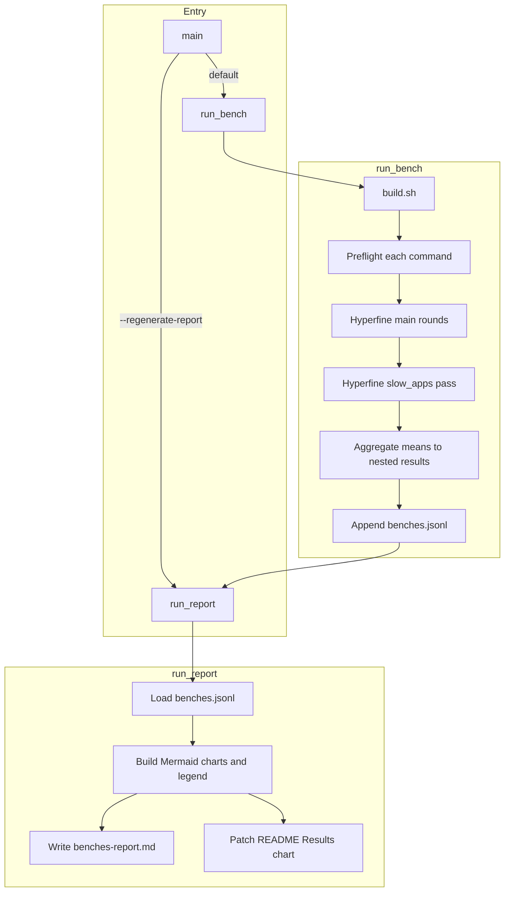
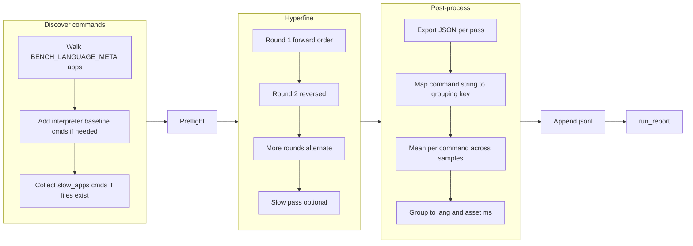
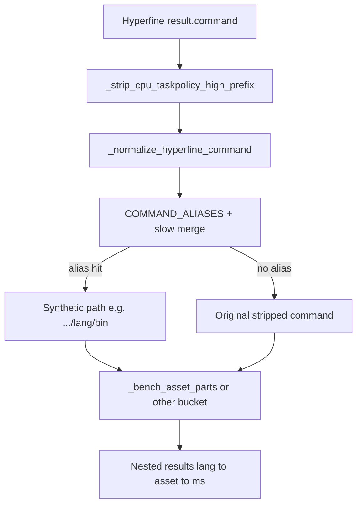
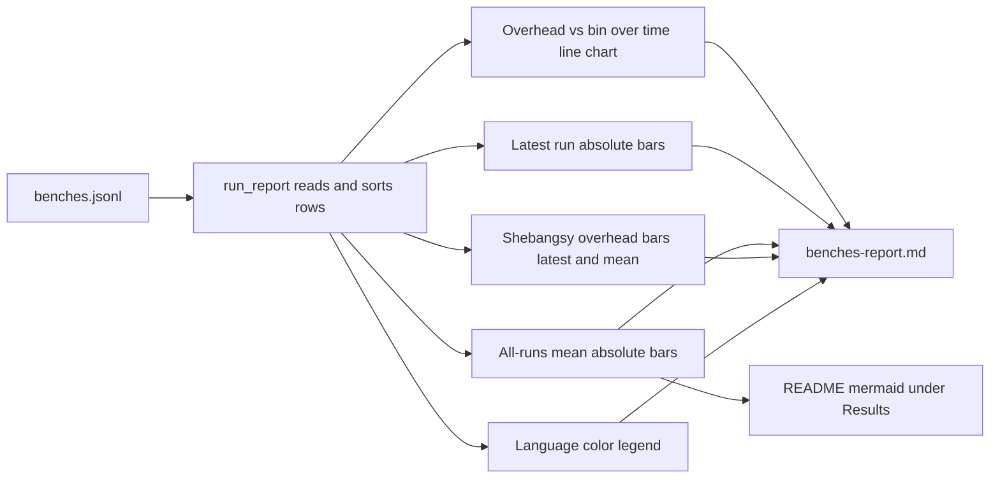

# Benchmark harness (`bench.py`)

This document describes [`bench.py`](./bench.py): what it measures, why it is shaped that way, and how the pieces connect. For day-to-day commands, see the benchmark section in the repo README, or run `just bench` (full run) and `just bench-report` (report only) from the repo root.

## What it does

`bench.py` is the single entry point for **automated comparative benchmarks** of shebangsy runners and related baselines across languages. It:

1. Ensures artifacts exist via `./scripts/build.sh`.
2. Runs every configured bench command once (**preflight**) so obvious failures surface before long hyperfine sessions.
3. Invokes **[hyperfine](https://github.com/sharkdp/hyperfine)** with `--shell=none` for the main command set, for several **rounds** with **alternating forward/reversed order** to reduce ordering bias.
4. Optionally runs a **second hyperfine pass** for `slow_apps` with fewer repeats per command.
5. Merges hyperfine JSON exports into **per-command mean times** (seconds internally), converts to **milliseconds**, and groups results into a nested **`language → asset → ms`** object.
6. **Appends one JSON object per bench run** to `benches.jsonl` (timestamp, CPU label, results).
7. Regenerates **`benches-report.md`** (Mermaid charts plus a language color legend) and replaces the first **```mermaid** block under **`### Results`** in `README.md` with the “mean time over all runs” chart.

**Report only:** `./scripts/bench.py --regenerate-report` (or **`just bench-report`**) runs `run_report` against the current `benches.jsonl` and skips build, preflight, and hyperfine. A full `just bench` / default `bench.py` invocation still ends by calling `run_report` after appending a new jsonl row.

## Why it is designed this way

- **Same tree, comparable numbers**: Commands are rooted under `scripts/bench-assets/<lang>/` so paths and grouping stay stable across machines and commits.
- **Baselines**: Compiled `bin` targets and plain **interpreter** invocations (e.g. `python3 …/shebangsy.py`) sit in the same hyperfine list where configured. Interpreter lines are **aliased** in results to a synthetic `./scripts/bench-assets/<lang>/bin` key so charts can compare “script vs bin” per language without duplicating legend rows for two different spellings of the same idea.
- **Fairness knobs**: Multiple hyperfine rounds with reversed order, warmup runs, and many measured runs per command reduce noise and slot-order effects. Slow apps get their own pass so the main grid stays fast while still recording heavier cases.
- **History and communication**: `benches.jsonl` is append-only **evidence**; Markdown + Mermaid charts make trends visible in the repo without a separate dashboard.
- **Optional macOS QoS**: When `CPU_TASKPOLICY_HIGH` is true, commands run under `taskpolicy -c high -- …`; the prefix is stripped when grouping so jsonl keys do not change.

## Prerequisites

- `hyperfine` on `PATH` (install hint is printed if missing).
- Bench assets listed in `BENCH_LANGUAGE_META` present on disk under `scripts/bench-assets/`.
- Successful `./scripts/build.sh` from the repo root (dist binaries on `PATH` for the bench process).

## Main configuration surface

| Area | Where | Role |
|------|--------|------|
| Per-language apps and colors | `BENCH_LANGUAGE_META` in `bench.py` | Defines `apps`, optional `slow_apps`, optional interpreter baseline, and chart colors for reports. |
| Hyperfine counts | `HYPERFINE_*` constants | Rounds, warmup, runs per command, slow-pass runs. |
| CPU QoS | `CPU_TASKPOLICY_HIGH` | Optional `taskpolicy -c high` wrapper (see above). |

Interpreter baseline commands are normalized and mapped through **`COMMAND_ALIASES`** (built at import time) plus **`_merge_slow_interpreter_aliases()`** for slow-app interpreter lines, so they group under the same synthetic `bin` key as the main baseline when applicable.

## Artifacts

| Path | Direction | Meaning |
|------|-----------|---------|
| `benches.jsonl` | Append | One line per run: `time`, `cpu`, `results` (nested ms map). |
| `benches-report.md` | Overwrite | Human-readable report with multiple Mermaid charts and a color legend. |
| `README.md` | Patch one fence | `### Results` section: first mermaid fence replaced with the all-runs mean-time chart. |

---

## Diagram: end-to-end flow



---

## Diagram: `run_bench` sequence



---

## Diagram: from hyperfine command string to jsonl `results`

Hyperfine reports each benchmark command as a string. That string is **normalized**, **taskpolicy-stripped** if applicable, looked up in **alias tables**, then parsed for **`./scripts/bench-assets/...`** path segments to produce **`language`** and **`asset`** keys in the nested JSON.



---

## Diagram: `run_report` inputs and outputs



Charts use **Mermaid `xychart-beta`** blocks: absolute-time bars share a horizontal bar helper with a fixed ms cap for scale; overhead charts use **script ms minus same-language `bin` ms** for assets whose filenames include `shebangsy` (where `bin` exists in that run).

---

## Related paths

- Script: [`bench.py`](./bench.py)
- Assets: `scripts/bench-assets/<lang>/…`
- Build: `scripts/build.sh`
